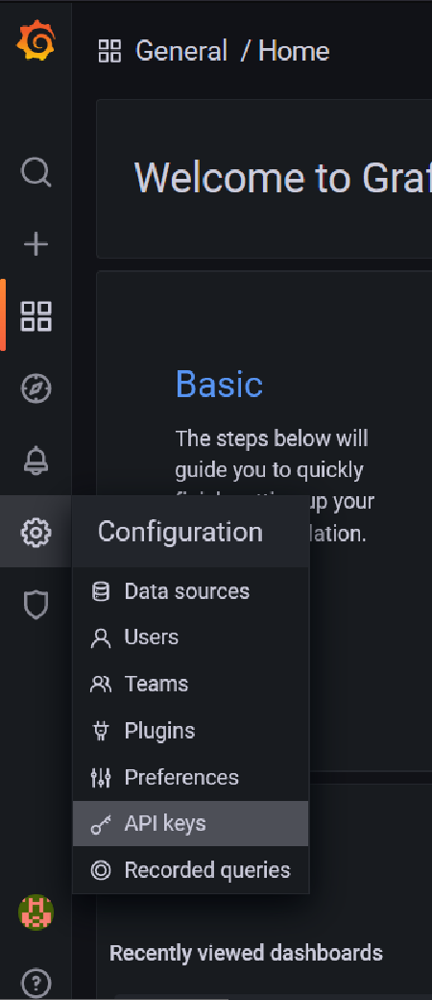

= Hayame

Yeah, here we go again!

Another Discord bot, so some info about the content.

== Invite the bot

You want  to invite the bot? Unfortunately, it's rarely online.
If you are interested, send me a DM, and I'll host it somewhere for you.
But for now, it's going to be offline 80% of the time.

== Tech stack

=== Discord related
- https://github.com/DV8FromTheWorld/JDA[JDA]
- https://github.com/freyacodes/Lavalink-Client[Lavalink client]

=== Database
- https://flywaydb.org/[Flyway]
- https://mariadb.org/[MariaDB], and https://mariadb.com/kb/en/about-mariadb-connector-j/[their Java client]
- https://github.com/brettwooldridge/HikariCP[HikariCP]

===  Statistics
- https://prometheus.io/[Prometheus], and https://github.com/prometheus/client_java[their Java client]

=== General
- https://github.com/FasterXML/jackson[Jackson]
- http://opencsv.sourceforge.net/[OpenCSV]
- https://github.com/JetBrains/java-annotations[Jetbrains annotations]
- https://logback.qos.ch/[Logback]

== Set-up

=== Config
The bot needs a config file with some info, like the Discord token. The template can be found https://github.com/Tais993/Hayame/blob/master/config.json[here].
During the rest of our set-up, we will populate this with some values.

At the moment of writing, you can already get a Discord token from the https://discord.com/developers/applications[developer portal].
Create an application, go to the bot settings, insert the token found there.

=== Prometheus

Prometheus is software for statistics, this (at the moment of writing) is required for the bot.
See the https://prometheus.io/docs/prometheus/latest/installation/[installation guide by Prometheus].
After you did that, replace the prometheus config with https://github.com/Tais993/Hayame/blob/master/prometheus-config.yml[this config].
Replace `PROMETHEUS-SERVER-BOT-PORT` with the port the bots prometheus server runs on. This also has to be set in the bots config, named `prometheus_bot_port`.

=== Grafana
Grafana is software for displaying the statistics, with a lot better UX/UI than Prometheus.
Grafana can be installed from https://grafana.com/grafana/download?edition=enterprise[their site], when using the default port, it's already set in the config.
Now you still need a key for the API, this way our bot can generate the dashboard/datasource.

Go to configuration -> API Keys. +
From this screen, go to "Add API KEY". +
Here, set the name to whatever you want. After this, set the role to Admin, and the time to live to however long you want to (recommend above 1 month).

On start-up, the bot will now take care of everything for you!

=== Maria-DB
Install MariaDB using https://mariadb.org/download/?t=mariadb&p=mariadb&r=10.6.7, please use version 10.6.7

During installation, you need to set a username and password and port, these have to be set in the bots config.

Now everytime your bot starts up, your DB will get updates (new tables, or old tables will get edited).

## Credits

My bot examples come mainly from my own development, still credits to https://github.com/Xirado/Bean[Bean] for the idea of adding statistics using Promethues and Grafana.
And thanks to https://github.com/Together-Java/TJ-Bot[TJ-Bot] for the idea of using Flyway.
